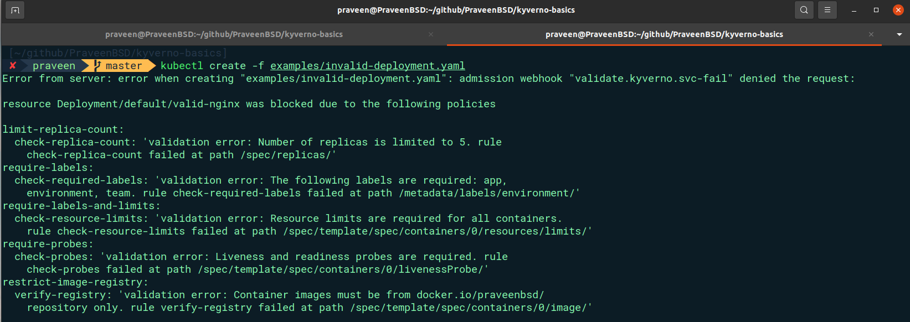

# 🛡️ Governance in Kubernetes Using Kyverno

## Table of Contents
1. [Introduction](#introduction)
2. [Why Do We Need Policies in Kubernetes?](#why-do-we-need-policies-in-kubernetes)
3. [What Is Kyverno?](#what-is-kyverno)
4. [Writing Kyverno Policies](#writing-kyverno-policies)
5. [Policies in This Repository](#policies-in-this-repository)
6. [Tutorial](#tutorial)
7. [Alternatives to Kyverno](#alternatives-to-kyverno)
8. [Conclusion](#conclusion)

## 📖 Introduction
Kubernetes is a powerful platform for managing containerized workloads, but ensuring governance, compliance, and operational best practices across clusters can be challenging. This project demonstrates how to use Kyverno, a Kubernetes-native policy management tool, to enforce policies and maintain governance in your clusters.

## ❓ Why Do We Need Policies in Kubernetes?

Here are the core reasons why policies in Kubernetes are essential:

### 🔒 Security
- Enforce strict rules on image registries to prevent the use of untrusted or vulnerable images.
- Block privileged containers that could potentially escalate security risks.
- Ensure that only authorized service accounts or users can perform sensitive operations, reducing the attack surface.
- Automatically label resources with security classification for proper access control and monitoring

### ⚙️ Operational Best Practices
- Ensure consistent application configurations with mandatory liveness and readiness probes. This helps keep workloads reliable and fault-tolerant by automatically checking the health of running services.
- Enforce consistent resource limits and requests across all deployments to prevent issues like resource starvation or excessive consumption of cluster resources.

### 📊 Resource Management
- Set limits on replica counts to prevent over-provisioning and ensure resources are allocated optimally.
- Require appropriate resource requests and limits for CPU and memory, ensuring that workloads don't monopolize resources and lead to instability.
- Enforce cost center and project labels for accurate resource tracking and billing allocation

### ✅ Compliance
- Meet regulatory or organizational standards by enforcing consistent configurations and operational practices. Policies can ensure that requirements like PCI-DSS, HIPAA, or ISO 27001 are automatically met by applying best practices.
  
Enforcing such policies is crucial for any Kubernetes-based deployment, especially as your cluster grows in complexity and scale. Without proper governance, the risk of misconfigurations, security breaches, and inefficient operations increases.


## 🗂️ What Is Kyverno?
Kyverno is a Kubernetes-native policy engine that allows you to:

- **✔️ Validate**: Check if resources conform to policies.
- **🔄 Mutate**: Automatically modify resources to meet standards.
- **➕ Generate**: Create new resources (e.g., default ConfigMaps).

Kyverno uses declarative policies, written in YAML, making it simple for Kubernetes administrators to enforce rules without writing complex scripts.

## 📝 Writing Kyverno Policies

### Policy Structure
Kyverno policies are defined in YAML files and have the following structure:

```yaml
apiVersion: kyverno.io/v1
kind: ClusterPolicy
metadata:
  name: example-policy
spec:
  rules:
  - name: example-rule
    match:
      resources:
        kinds:
        - Deployment
    validate:
      # Validation rules
    mutate:
      # Mutation rules
```

### Validation Rules
Validation rules define the conditions that resources must meet. For example, to ensure that all Pods have liveness and readiness probes:

```yaml
validate:
  message: "Liveness and readiness probes are required"
  pattern:
    spec:
      containers:
      - livenessProbe: {}
        readinessProbe: {}
```

### Mutation Rules
Mutation rules automatically modify resources to meet the desired state. For example, to add default labels to all resources using the patchStrategicMerge field:
```yaml
mutate:
  patchStrategicMerge:
    metadata:
      labels:
        team: foo
        environment: dev
```

### Common operators in Validation Rules

- **Equality (=)**: Checks if a value is equal to a specified value.
- **Inequality (!=)**: Checks if a value is not equal to a specified value.
- **Greater Than (>)/Less Than (<)**: Checks if a value is greater or less than a specified value.
- **Existence (?)**: Checks if a specified attribute exists in the resource.

For more information on writing Kyverno policies, please refer to the official Kyverno documentation on writing [validation-rules](https://kyverno.io/docs/writing-policies/validate/).


## 📂 Policies in This Repository

### 🧠 Best Practices
- `require-probes.yaml`: Ensures that all Pods have liveness and readiness probes for reliability.
reliability.

### 🗂️ Resource Management

- `limit-replica-count.yaml`: Limits the maximum replica count for Deployments to avoid excessive resource usage.
- `require-labels.yaml`: Ensures that all resources have mandatory labels for tracking.
- `require-limits.yaml`: Enforces CPU and memory limits for Pods to prevent over-allocation.
- `add-creator-label.yaml`: Adds a `created-by` label to Deployments and Services with the username of the user who deployed the resource.

### 🔐 Security

- `restrict-image-registry.yaml`: Restricts Pods to use images from a trusted container registry.

## 🧭 Tutorial

### 📋 Prerequisites
- **Kubernetes Cluster**: Use [Minikube](https://minikube.sigs.k8s.io/docs/start/) or any Kubernetes setup.
- **kubectl**: [kubectl](https://kubernetes.io/docs/tasks/tools/install-kubectl/) for managing Kubernetes resources.
- **helm**: [helm](https://helm.sh/docs/intro/install/) for installing kyverno in your k8s cluster.


### 🔧 Steps to Apply Policies

1. Clone the Repository
```bash
git clone https://github.com/PraveenBSD/kyverno-basics.git
cd kyverno-basics
```

2. Install Kyverno in Your Cluster
```bash
helm repo add kyverno https://kyverno.github.io/kyverno/
helm repo update
helm install kyverno kyverno/kyverno -n kyverno --create-namespace
```

3. Apply the Policies
Navigate to the policies directory and apply all policies:
```bash
kubectl apply -f policies/best-practices
kubectl apply -f policies/resource-management
kubectl apply -f policies/security
```

4. Verify the Policies
Check if the policies are successfully applied:
```bash
kubectl get clusterpolicy
```

### 🧪 Test With an Invalid Deployment

1. Apply the example invalid deployment:
```bash
kubectl apply -f examples/invalid-deployment.yaml
```

2. Observe the error:


### 🔧 Fix the Invalid Deployment

In the `examples/invalid-deployment.yaml` file, you can uncomment the following lines to add the required probes, resource limits, and labels:

Here's what you need to do:

1. **Uncomment the `livenessProbe` and `readinessProbe` sections**: This adds the required health checks to ensure your application is running correctly.
2. **Uncomment the `limits` section under `resources`**: This defines the maximum CPU and memory limits for the container, which helps prevent resource starvation.
3. **Add the `environment` and `team` labels to the deployment metadata**: These labels are required by the Kyverno policies in the repository.
4. **Change the container image to `praveenbsd/nginx`**: The Kyverno policy in this project restricts the allowed image registry to praveenbsd

Once you've made these changes, you can reapply the deployment:

```bash
kubectl apply -f examples/invalid-deployment.yaml
```

This should now pass the Kyverno policies you've set up in the repository.

### ☑️ Verifying Kyverno Mutate Policy

In addition to the validaton policies, this project also includes a Kyverno policy that automatically adds labels to Deployments and Services.

This policy will add `created-by` labels to any new Deployment or Service that is created in the cluster. To verify if the policy had applied, let check the labels of the above applied `invalid-deployment.yaml`

```
kubectl get deployment invalid-nginx --show-labels
```

The output should show the following labels:

```
NAME          READY   UP-TO-DATE   AVAILABLE   AGE   LABELS
invalid-nginx   0/1     0            0           11m   app=nginx,created-by=minikube-user,environment=production,team=platform
```

This will display the labels applied to the Deployment, including the `created-by` added by the Kyverno mutate policy.

## 💡 Alternatives to Kyverno
- **Open Policy Agent (OPA) + Gatekeeper**: A powerful alternative that uses Rego for writing policies.
- **Kubewarden**: A policy engine that allows policies to be written in WebAssembly (WASM).

## 🌟 Conclusion
This project demonstrates how Kyverno simplifies governance in Kubernetes. By applying declarative policies, you can enforce best practices, enhance security, and ensure compliance with minimal effort.
